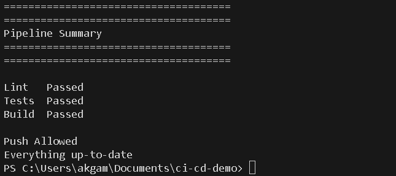
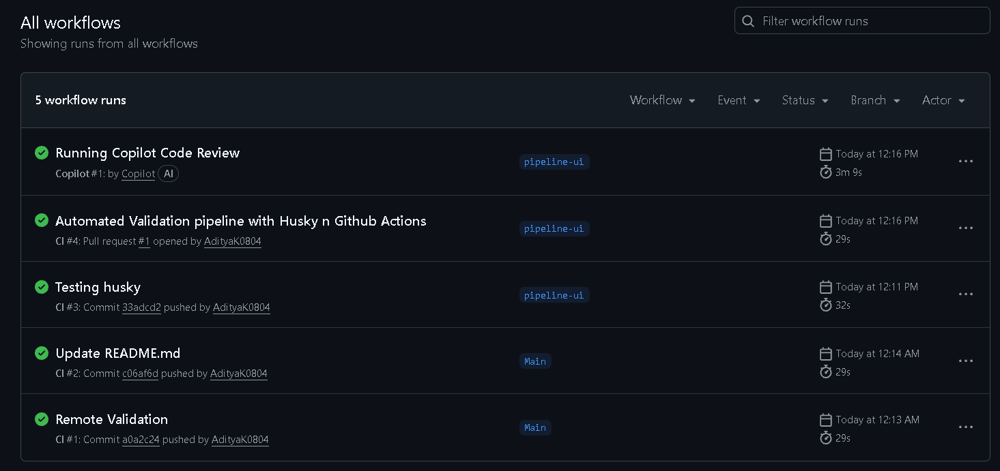
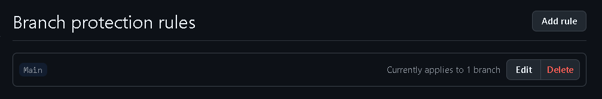

# Automated CI/CD Pipeline

## Project Overview

The goal of this project is to implement an automated CI/CD pipeline that validates and prevents broken code from reaching the protected main branch.

The pipeline performs validation at multiple steps of the development workflow. Local validation (i.e before code reaches to GitHub) is performed using Husky hooks while the Remote validation (i.e after code is pushed to GitHub) is handled through GitHub Actions. Additionally, Branch protection rules makes sure that changes can't be merged unless all CI checks pass.

This implementation follows a fail-fast approach where validation stages are executed sequentially in the following order:

                            Lint → Test → Build

If any stage/step fails, the remaining stages are skipped and the push/merge is blocked.

---

## Architecture

The entire system consists of three layers:

### Layer 1: Local Validation

Validation begins on the developer machine before code reaches GitHub.

### Pre-Commit Hook

Implemented using Husky and lint-staged.

Why this approach?

- Husky integrates validation directly into the Git workflow.
- lint-staged runs checks only on staged files, keeping commits fast.
- Developers receive feedback before code enters the repository.

### Pre-Push Hook

The pre-push hook runs the complete validation pipeline:

                        Lint → Test → Build

Why this approach?

- Prevents broken code from reaching GitHub.
- Reduces any CI failures.
- Provides immediate feedback before code is pushed.

## Layer 2: Remote Validation

The second validation is performed by GitHub Actions after the code is pushed to GitHub.

The workflow runs on:

* Push events
* Pull Request events

Validation order:

```text
Lint → Test → Build
```
Same validation order as done locally.

Why this approach?

* Ensures validation in an isolated environment, thereby preventing alteration of the main branch.
* Prevents broken code from reaching the main branch.

### Dependency Caching

npm dependencies are cached between workflow runs to reduce installation time and improve CI performance.

---

## Layer 3: Branch Protection

The main branch is protected and requires all CI checks to pass before a pull request can be merged.

Why this approach?

* Prevents direct merges of broken code.
* Ensures every change is validated before reaching the main branch.

---

## Pull Request Workflow

Developer → Pre-Commit → Pre-Push → GitHub Actions → Branch Protection → Merge

Only when all validation stages pass is the pull request allowed to merge.

---

## Tech Stack

* React
* TypeScript
* Vite
* ESLint
* Vitest
* Husky
* lint-staged
* GitHub Actions
* GitHub Branch Protection

## Running Locally

Clone the repository:

```bash
git clone https://GitHub.com/AdityaK0804/ci-cd-demo.git
cd ci-cd-demo
```

Install dependencies:

```bash
npm install
```

Start the application:

```bash
npm run dev
```

Run validations manually:

```bash
npm run lint
npm run test
npm run build
```

---

## How the Pipeline Works

The validation process follows a fail-fast approach:

Lint → Test → Build

Validation occurs in three layers:

1. Local Validation (Husky Hooks)
2. Remote Validation (GitHub Actions)
3. Merge Protection (Branch Protection Rules)

If any stage fails, execution stops immediately and the remaining stages are skipped.

---

## What the Pipeline Blocks

The pipeline prevents:

* Code with ESLint violations
* Code with failing automated tests
* Code that cannot be built successfully

Blocked code cannot:

* Be pushed successfully from the local machine
* Pass GitHub Actions validation
* Be merged into the protected main branch

---

## Proof of Working

### Successful Validation

* Lint Passed
* Tests Passed
* Build Passed
* Push Allowed



### Blocked Validation

* Lint Failed / Test Failed / Build Failed
* Push Blocked


### GitHub Actions Validation



### Branch Protection


---

## Future Improvements

* Automated deployment after successful validation
* Support for multiple Node.js versions
* Workflow status badges
* Notification integrations
* Additional automated test coverage
